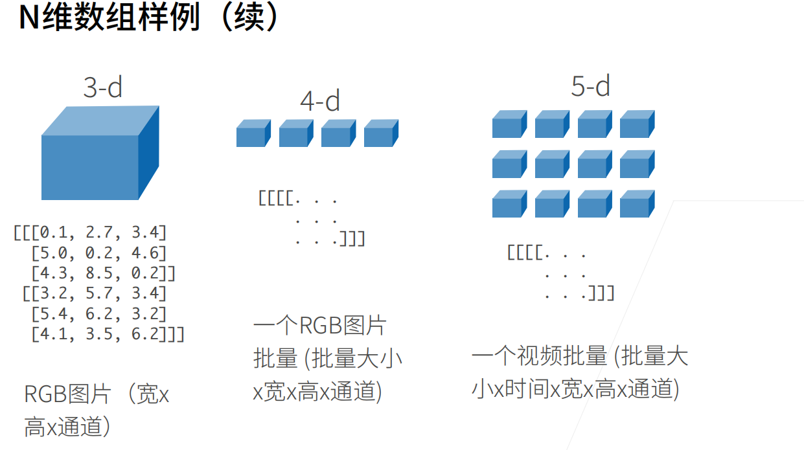
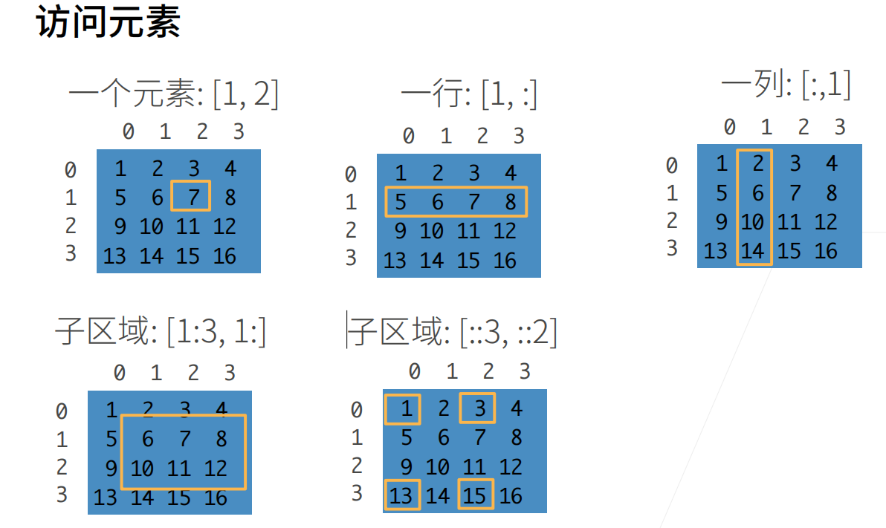

# 2.预备知识

## 2.1. 数据操作




###### 0维标量：比如：整型， 浮点数， 字符

###### 1维向量：**有序的标量序列，有方向性**

###### **2维矩阵**:**向量的集合，有行和列**

###### **3维**:**立体数据，矩阵的堆叠，有深度概念**

###### **4维:批次数据，**多个3维数据的集合，比如图像数据NCHW

[^N]: Batch Size（批次大小）
[^C]: Channels（通道数）
[^H]: Height（高度）
[^W]: Width（宽度）

访问元素：



[::3, ::2\]]: 行步长为3，列步长为2


### 2.1.1. 入门

参考https://github.com/d2l-ai/d2l-zh-pytorch-slides下的`chapter_preliminaries`顺序为：`ndarray.ipynb`

```python
x.numel()
```

[^x.numel]: `number of elements` 统计元素总数

```python
torch.randn(3, 4)
```

[^torch.randn]: `2维矩阵，3行4列，random + normal（正态分布随机数）`

### 2.1.2. 运算符

**2D代码**：

```
X = torch.arange(12, dtype=torch.float32).reshape((3,4))
Y = torch.tensor([[2.0, 1, 4, 3], [1, 2, 3, 4], [4, 3, 2, 1]])
torch.cat((X, Y), dim=0)
```

`torch.cat` **中 dim = 0 行合并，2D输出结果如下**：

```
把y 的两个矩阵放到x的两个矩阵下面
 tensor([[ 0.,  1.,  2.,  3.],
         [ 4.,  5.,  6.,  7.],
         [ 8.,  9., 10., 11.],
         [ 2.,  1.,  4.,  3.],
         [ 1.,  2.,  3.,  4.],
         [ 4.,  3.,  2.,  1.]]),
```

 `torch.cat((X, Y), dim=1)`

`torch.cat` **中 dim = 1列合并，2D输出结果如下**：

```
tensor([[ 0.,  1.,  2.,  3.,  2.,  1.,  4.,  3.],
         [ 4.,  5.,  6.,  7.,  1.,  2.,  3.,  4.],
         [ 8.,  9., 10., 11.,  4.,  3.,  2.,  1.]]))
```

**3D代码**：

```
X = torch.arange(24, dtype=torch.float32).reshape((2,3,4))
Y = torch.tensor([
    [[2.0, 1, 4, 3], [1, 2, 3, 4], [4, 3, 2, 1]],
    [[2.0, 1, 4, 3], [1, 2, 3, 4], [4, 3, 2, 1]]
])
torch.cat((X, Y), dim=0)
```

`torch.cat` **中 dim = 0 矩阵堆叠，3D输出结果如下**：

```python
3维 x = tensor([[[ 0.,  1.,  2.,  3.],
         [ 4.,  5.,  6.,  7.],
         [ 8.,  9., 10., 11.]],

        [[12., 13., 14., 15.],
         [16., 17., 18., 19.],
         [20., 21., 22., 23.]]])
3维 y = tensor([[[2., 1., 4., 3.],
         [1., 2., 3., 4.],
         [4., 3., 2., 1.]],

        [[2., 1., 4., 3.],
         [1., 2., 3., 4.],
         [4., 3., 2., 1.]]])
dim = 0, tensor([[[ 0.,  1.,  2.,  3.],
         [ 4.,  5.,  6.,  7.],
         [ 8.,  9., 10., 11.]],

        [[12., 13., 14., 15.],
         [16., 17., 18., 19.],
         [20., 21., 22., 23.]],

        [[ 2.,  1.,  4.,  3.],
         [ 1.,  2.,  3.,  4.],
         [ 4.,  3.,  2.,  1.]],

        [[ 2.,  1.,  4.,  3.],
         [ 1.,  2.,  3.,  4.],
         [ 4.,  3.,  2.,  1.]]])
```

从结果看出：

```
dim = 0 是矩阵堆叠 把y 的两个矩阵放到x的两个矩阵下面
  [
      X的第1个矩阵,  # [[0,1,2,3], [4,5,6,7], [8,9,10,11]]
      X的第2个矩阵,  # [[12,13,14,15], [16,17,18,19], [20,21,22,23]]  
      Y的第1个矩阵,  # [[2,1,4,3], [1,2,3,4], [4,3,2,1]]
      Y的第2个矩阵   # [[2,1,4,3], [1,2,3,4], [4,3,2,1]]
  ]
```

`torch.cat`  **中 dim = 1 行合并，3D输出结果如下**：

```
dim = 1, tensor([[[ 0.,  1.,  2.,  3.],
         [ 4.,  5.,  6.,  7.],
         [ 8.,  9., 10., 11.],
         [ 2.,  1.,  4.,  3.],
         [ 1.,  2.,  3.,  4.],
         [ 4.,  3.,  2.,  1.]],

        [[12., 13., 14., 15.],
         [16., 17., 18., 19.],
         [20., 21., 22., 23.],
         [ 2.,  1.,  4.,  3.],
         [ 1.,  2.,  3.,  4.],
         [ 4.,  3.,  2.,  1.]]])
```

从结果看出：

```
dim = 1 是行合并
结构：
[
    [  # 第1个矩阵
        X的第1行: [0,1,2,3],
        X的第2行: [4,5,6,7], 
        X的第3行: [8,9,10,11],
        Y的第1行: [2,1,4,3],  # ← 新增的行
        Y的第2行: [1,2,3,4],  # ← 新增的行
        Y的第3行: [4,3,2,1]   # ← 新增的行
    ],
    [  # 第2个矩阵
        X的第1行: [12,13,14,15],
        X的第2行: [16,17,18,19],
        X的第3行: [20,21,22,23], 
        Y的第1行: [2,1,4,3],  # ← 新增的行
        Y的第2行: [1,2,3,4],  # ← 新增的行
        Y的第3行: [4,3,2,1]   # ← 新增的行
    ]
]
```

`torch.cat` **中 dim = 2 列合并，3D输出结果如下**：

```
dim = 2, tensor([[[ 0.,  1.,  2.,  3.,  2.,  1.,  4.,  3.],
         [ 4.,  5.,  6.,  7.,  1.,  2.,  3.,  4.],
         [ 8.,  9., 10., 11.,  4.,  3.,  2.,  1.]],

        [[12., 13., 14., 15.,  2.,  1.,  4.,  3.],
         [16., 17., 18., 19.,  1.,  2.,  3.,  4.],
         [20., 21., 22., 23.,  4.,  3.,  2.,  1.]]])
```

从结果看出：

```
dim = 2 是列合并
结构：
[
    [  # 第1个矩阵
        [0,1,2,3, 2,1,4,3],  # X第1行 + Y第1行
        [4,5,6,7, 1,2,3,4],  # X第2行 + Y第2行  
        [8,9,10,11, 4,3,2,1] # X第3行 + Y第3行
    ],
    [  # 第2个矩阵
        [12,13,14,15, 2,1,4,3],  # X第1行 + Y第1行
        [16,17,18,19, 1,2,3,4],  # X第2行 + Y第2行
        [20,21,22,23, 4,3,2,1]   # X第3行 + Y第3行
    ]
]
```


```
X.sum()
```

[^X.sum()]: 需要注意的是它不是对求矩阵的和，而是每个元素相加的和

### 2.1.3. 广播机制

```
a = torch.arange(3).reshape((3, 1))
b = torch.arange(2).reshape((1, 2))
a, b
```

这个例子中的广播机制：a 是 3X1的2维矩阵，b是1X2的2维矩阵

```
(tensor([[0],
         [1],
         [2]]),
 tensor([[0, 1]]))
```

结果：a 扩充为3X2的2维矩阵, b扩充3X2的2维矩阵

```
0 0  + 0 1	   0 1
1 1  + 0 1  =  1 2
2 2  + 0 1	   2 3
```

```
tensor([[0, 1],
        [1, 2],
        [2, 3]])
```

### 2.1.4. 索引和切片

```
X[-1], X[1:3]
```

可以用`[-1]`选择最后一个元素，可以用`[1:3]`选择第二个和第三个元素

### 2.1.5. 节省内存（原地操作）

```
before = id(Y)
Y = Y + X
id(Y) == before
```

[^id(Y)]: 获取Y的IP地址

```
Z = torch.zeros_like(Y)
print('id(Z):', id(Z))
Z[:] = X + Y
print('id(Z):', id(Z))
```

[^torch.zeros_like]: 创建一个与输入张量形状（shape）相同、但所有元素都为0的新张量

🎯 内存变化图示：

```
Z = X + Y
操作前:
Z → [内存块A: 全0数据]

操作后:
Z → [内存块B: X+Y的结果]  # Z指向了新内存
```

```
Z[:] = X + Y
text
操作前:
Z → [内存块A: 全0数据]

操作后:
Z → [内存块A: X+Y的结果]  # 同一块内存，内容被覆盖
```

### 2.1.6. 转换为其他Python对象

```
a = torch.tensor([3.5])
a, a.item(), float(a), int(a)
```

```
(tensor([3.5000]), 3.5, 3.5, 3)
```

[^a.item()]: 提取标量值

### 2.1.7. 小结

### 2.1.8. 练习

1. 运行本节中的代码。将本节中的条件语句`X == Y`更改为`X < Y`或`X > Y`，然后看看你可以得到什么样的张量。

```
tensor([[ True, False,  True, False],
        [False, False, False, False],
        [False, False, False, False]])
```

   2.用其他形状（例如三维张量）替换广播机制中按元素操作的两个张量。结果是否与预期相同？

```
import torch

# 3维张量 A: (2, 1, 4)
A = torch.tensor([
    [[1, 2, 3, 4]],           # 第一个2D矩阵
    [[5, 6, 7, 8]]            # 第二个2D矩阵
])  # 形状: (2, 1, 4)

# 3维张量 B: (1, 3, 1)  
B = torch.tensor([
    [[10], [20], [30]]        # 3个行向量
])  # 形状: (1, 3, 1)

print("A形状:", A.shape)
print("B形状:", B.shape)

# 广播操作
result = A + B
print("结果形状:", result.shape)
print("广播结果:")
print(result)
```

```
A形状: torch.Size([2, 1, 4])
B形状: torch.Size([1, 3, 1])
结果形状: torch.Size([2, 3, 4])
广播结果:
tensor([[[11, 12, 13, 14],
         [21, 22, 23, 24],
         [31, 32, 33, 34]],

        [[15, 16, 17, 18],
         [25, 26, 27, 28],
         [35, 36, 37, 38]]])
```

