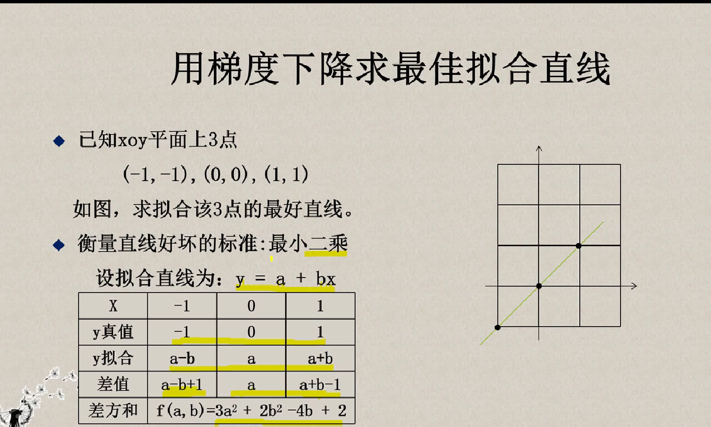
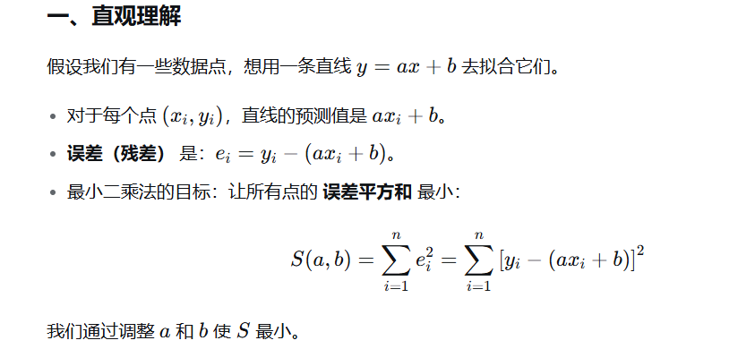
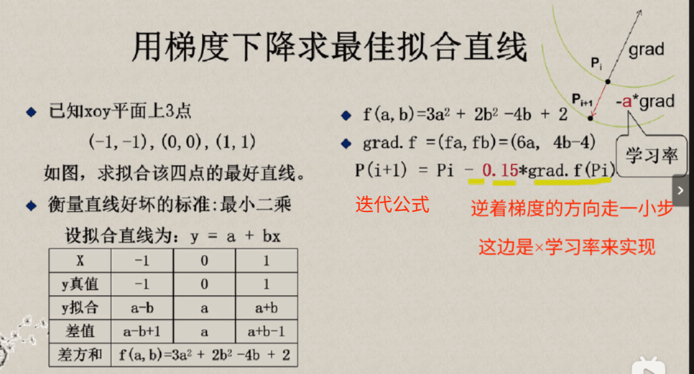
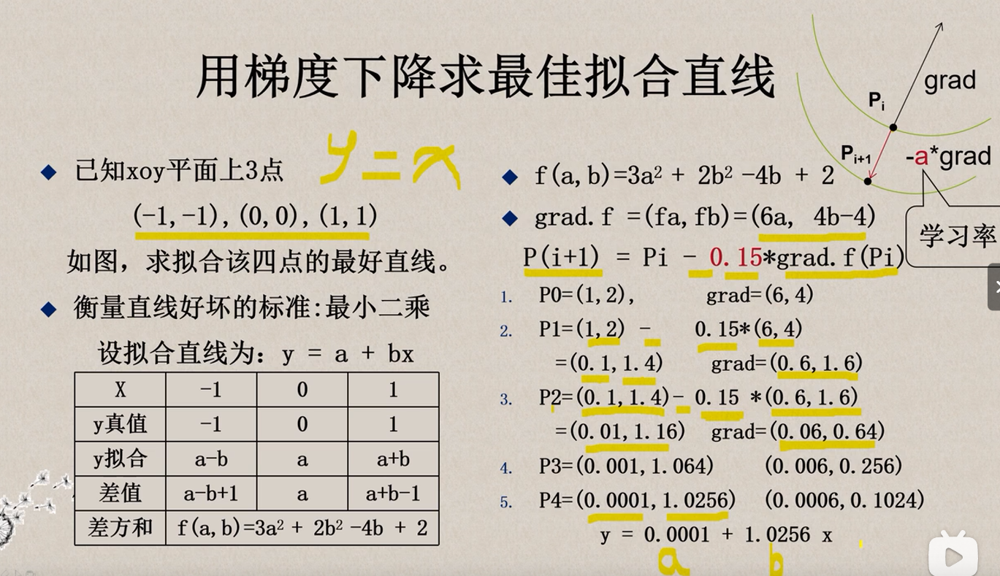

**拟合（Fitting）** 是指通过构建一个数学模型（函数或曲线）来**最佳地描述或匹配**一组已知数据点的过程。
其核心思想是让模型能够捕捉数据中的规律，从而可以预测未知数据或理解数据之间的关系。

### 拟合的核心概念（用比喻和例子解释）

#### 1. **直观比喻**

想象你有一张纸上散落的一些点（数据），你想画一条“最合适”的平滑曲线穿过它们，这条曲线就是**拟合的模型**。

- **如果完全穿过每个点** → 叫**插值**（但可能过拟合，对噪声敏感）。
- **如果大致接近大部分点，允许有误差** → 叫**拟合**（更关注整体趋势）。

#### 2. **为什么需要拟合？**

因为数据常有噪声、误差或不完整性，我们想要一个简洁的数学公式来概括数据的主要模式，而不是记住每一个数据点。

**最小二乘法（Least Squares Method）** 是一种最常用的数据**拟合**方法，它的核心思想是：
**通过最小化“预测值与实际值之差的平方和”来找到最优的模型参数。**

