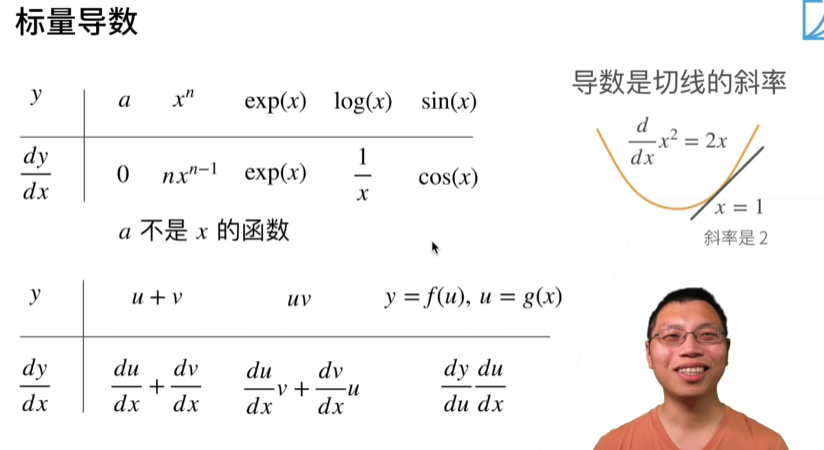

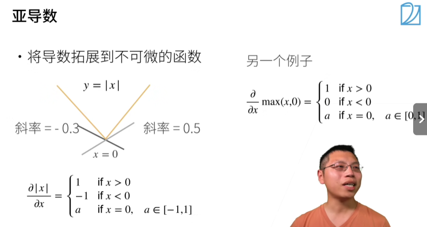

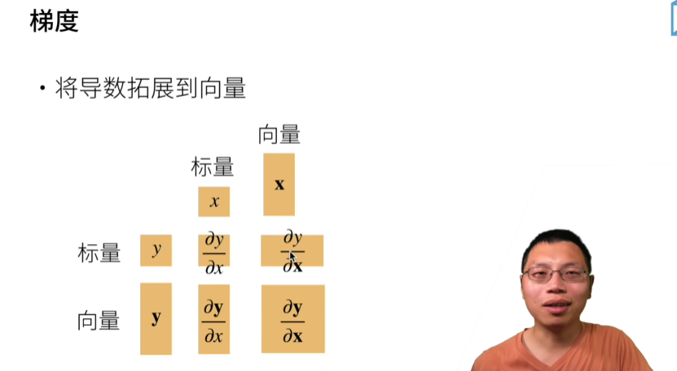

| 输入                  | 输出 |
| :-------------------- | :--- |
| 向量 **y**标量 **x**  | 标量 |
| 向量 **y**向量 **x**  | 矩阵 |
| 标量 **x **标量 **y** | 标量 |
| 向量 **x**标量 **y**  | 向量 |
| 向量 **x**向量 **y**  | 矩阵 |

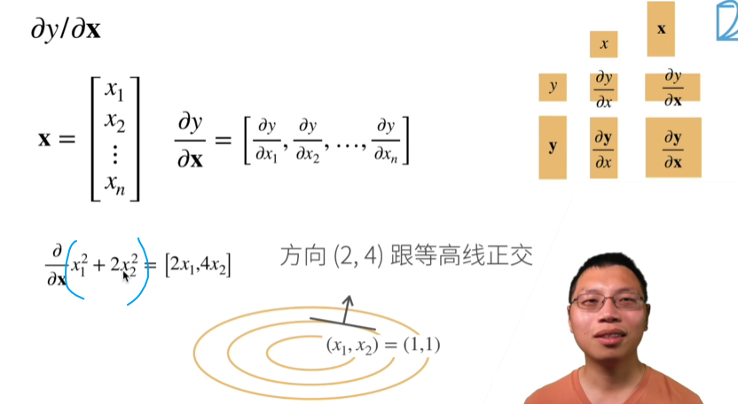

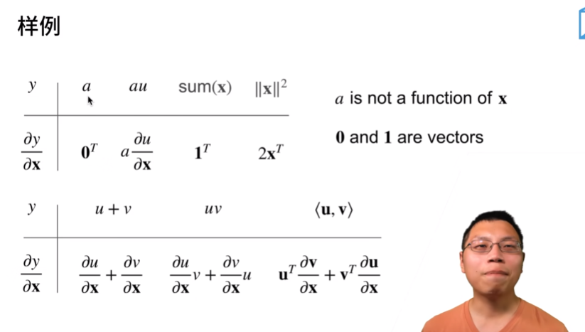

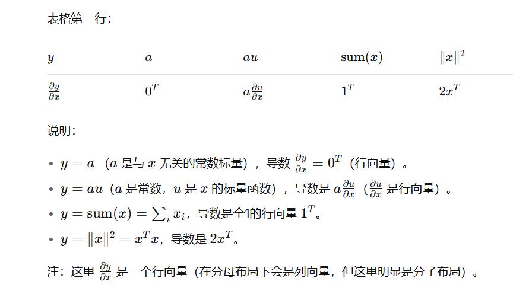

**我们先理解下**：**标量函数**是指**输出是一个数（标量）** 的函数。

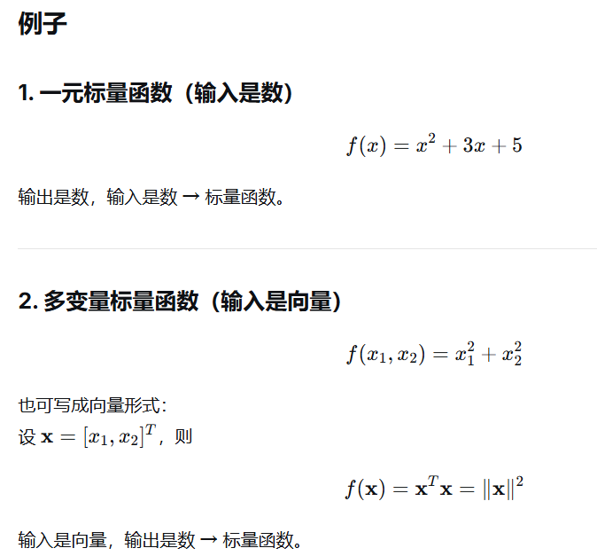

**我们看这个**：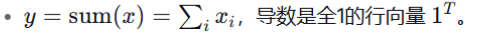

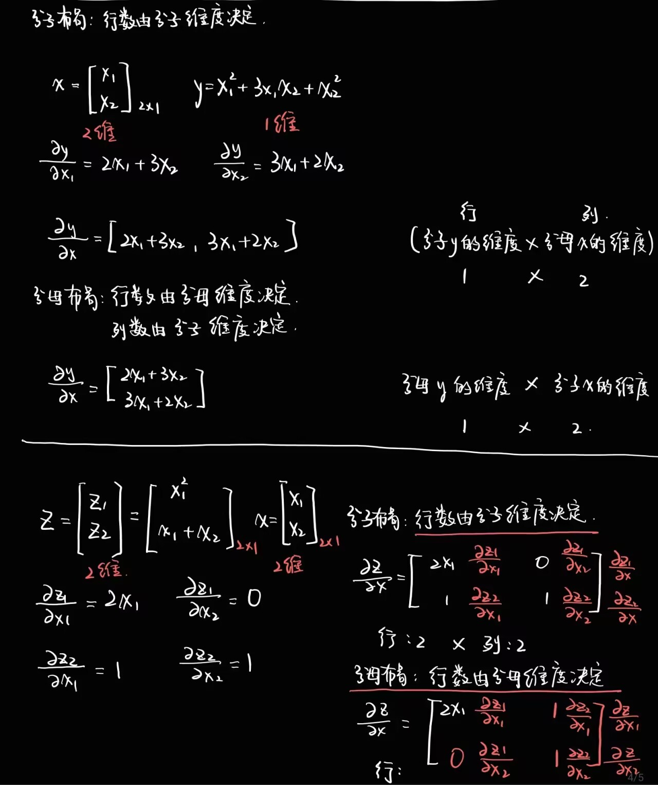

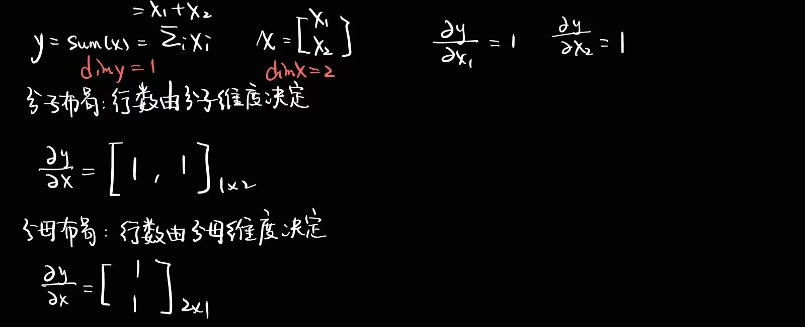

**所以李沐这里用的是分子布局**

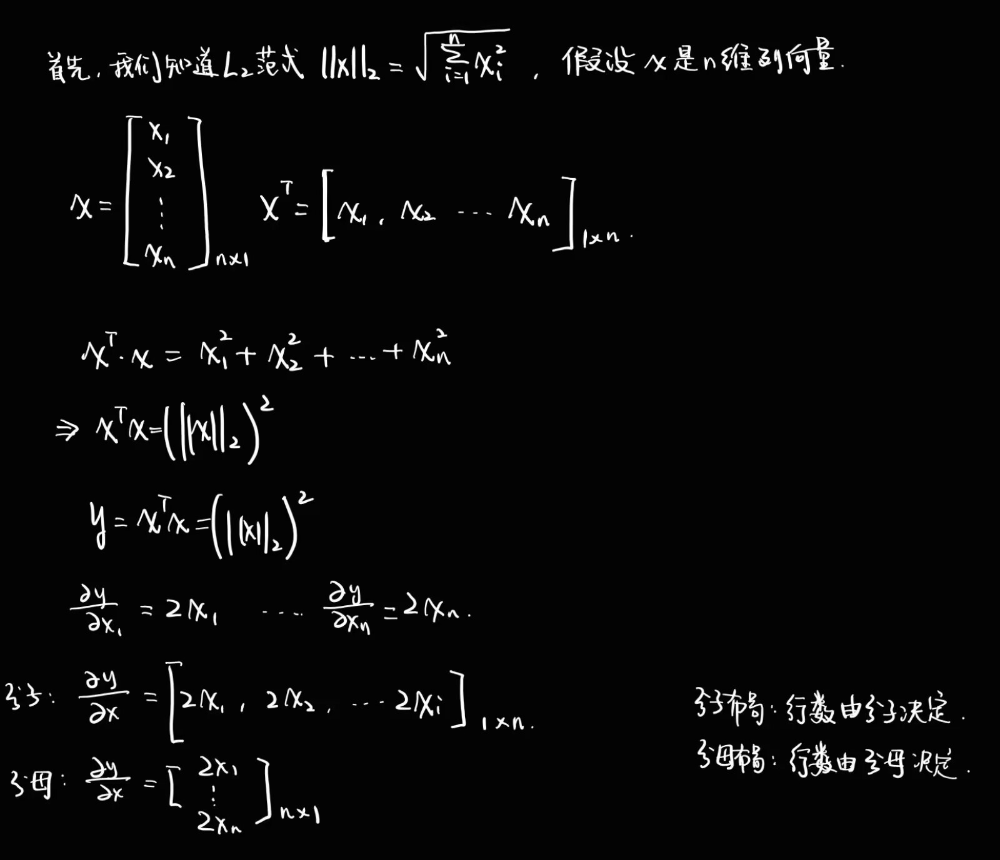

**我们再看看**

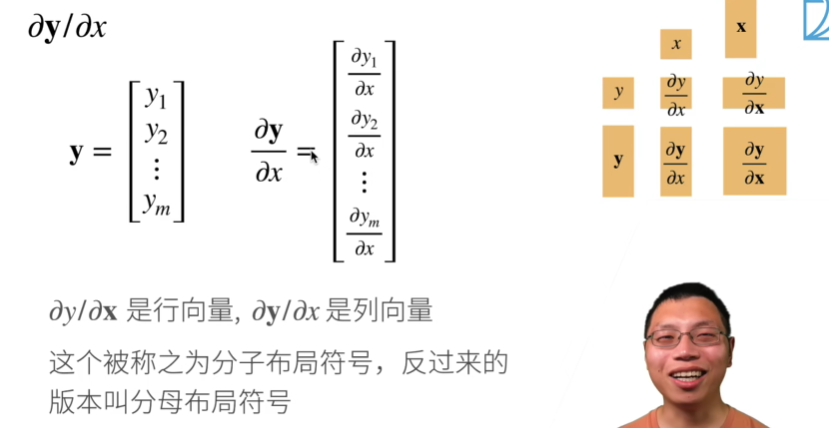

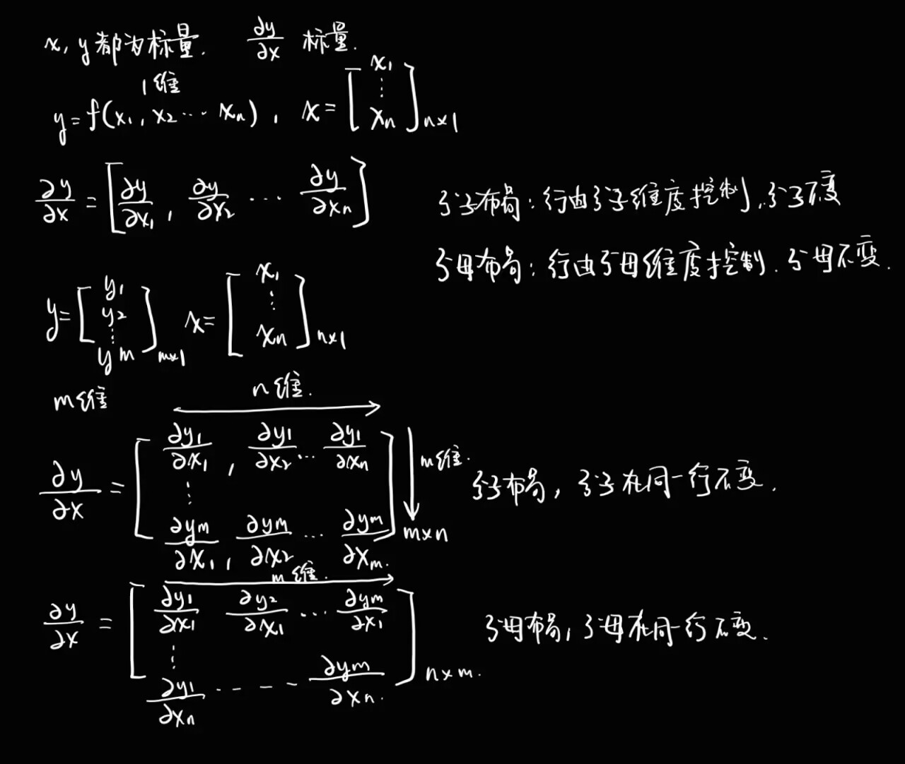

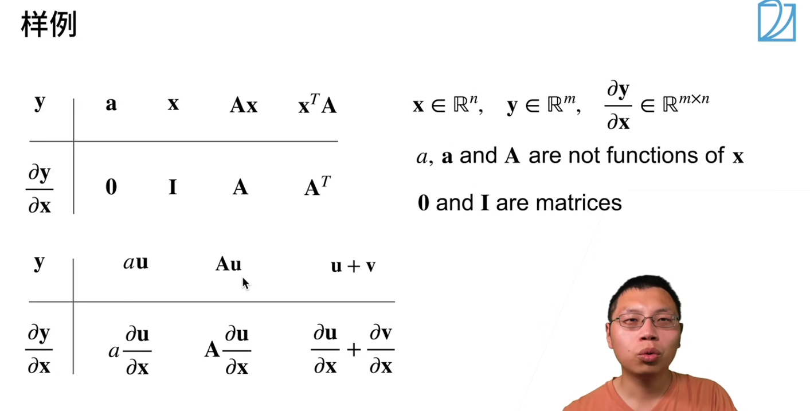

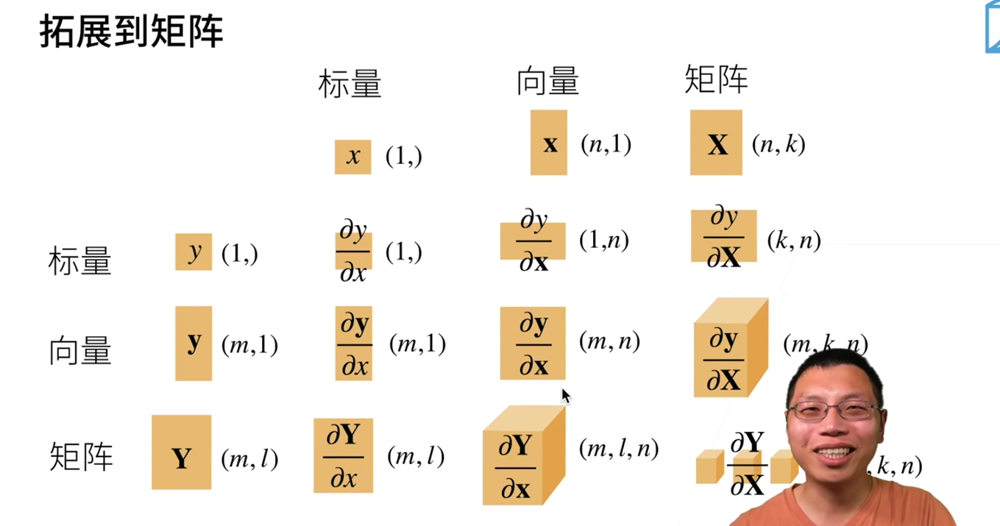

