## 2.3. 线性代数

### 2.3.1. 标量

标量就是0维张量,下方是标量的一些计算公式

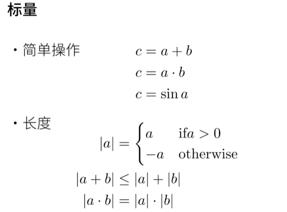

### 2.3.2. 向量

下方是向量的一些计算公式和不等式

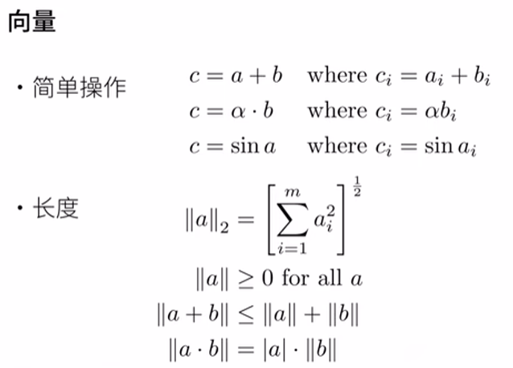

向量运算示意图

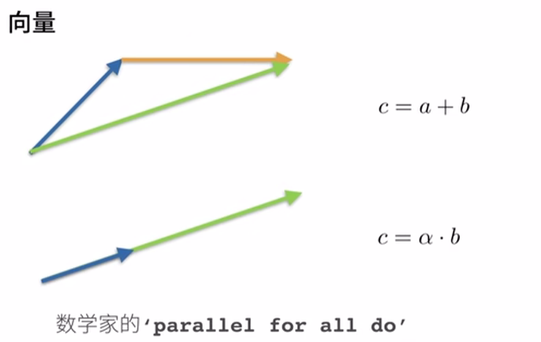

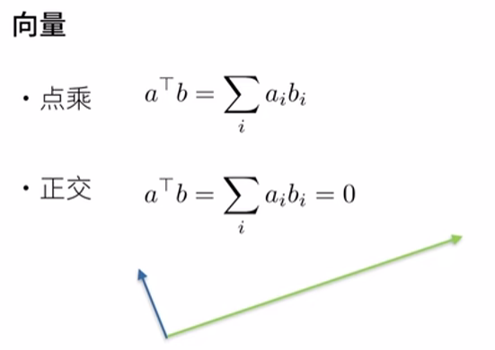


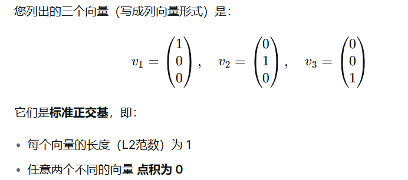


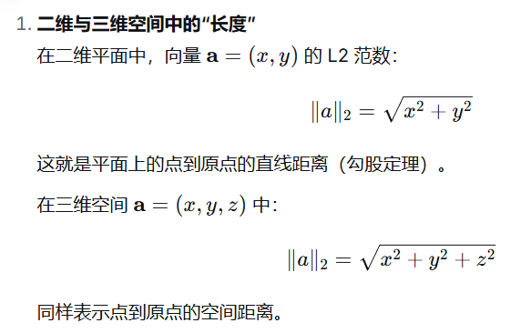

向量可以被视为标量值组成的列表。

```python
x = torch.arange(4)
x
```

#### 2.3.2.1. 长度、维度和形状

```
len(x) # len()函数来访问张量的长度
x.shape # 也可以通过.shape属性访问向量的长度
```

### 2.3.3. 矩阵

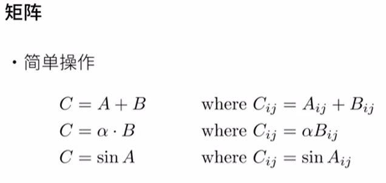

矩阵乘法：行*列

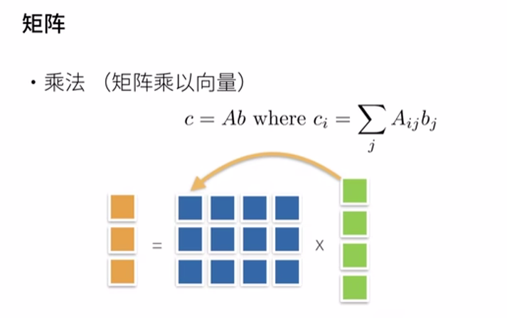

矩阵作用在向量上，相当于把向量扭曲了

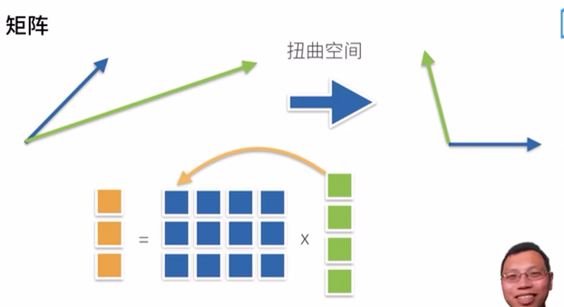

矩阵乘法

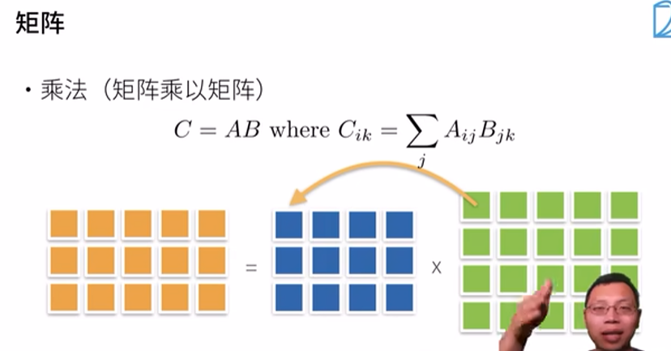

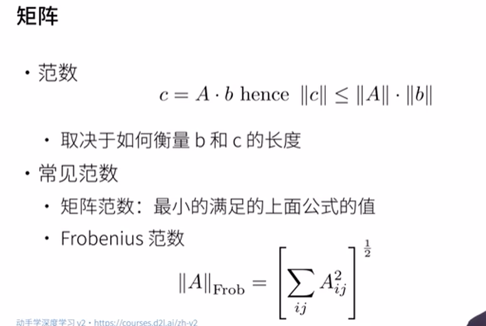

Frobenius 范数就是把矩阵拉成一个一维向量，然后每个元素求平方后加起来最后开根号

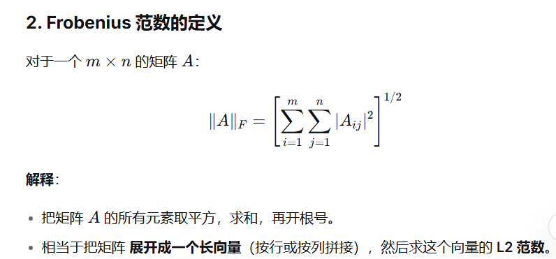

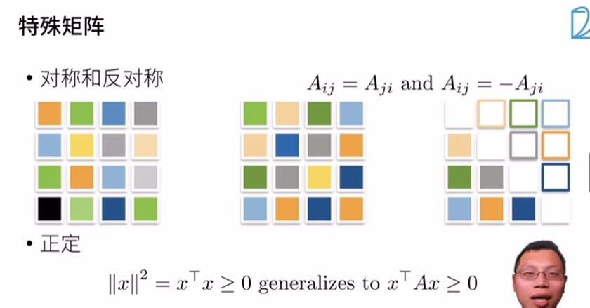

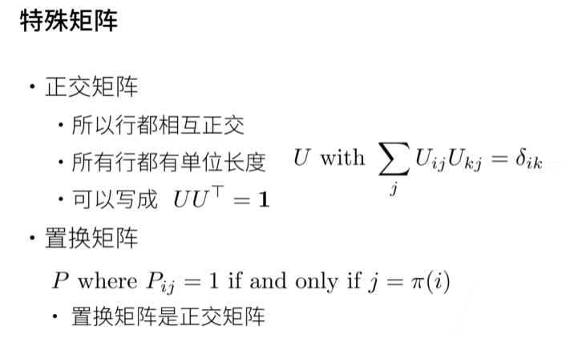

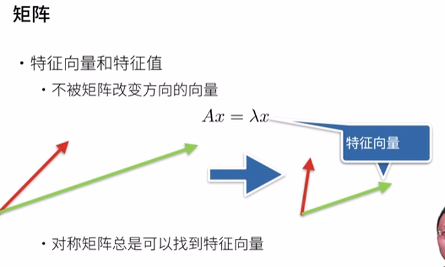

```python
A = torch.arange(20).reshape(5, 4) # 创建 5行4列20个元素的矩阵
A.T # 打印A的转置矩阵
```

### 2.3.4. 张量

```python
A = torch.arange(24).reshape(2, 3, 4)
A
```

输出结果：

```python
tensor([[[ 0,  1,  2,  3],
         [ 4,  5,  6,  7],
         [ 8,  9, 10, 11]],

        [[12, 13, 14, 15],
         [16, 17, 18, 19],
         [20, 21, 22, 23]]])
```

练习示例：

```python
import numpy as np
A = np.array([1, 2, 3]) 
print(A.shape)
print(A.ndim)
A
```

输出如下：

```python
(3,) # 这是一个一维数组（元组只有一个元素）
1 # 一维
[1 2 3]
```

若是2维就可以看到效果：

```python
import numpy as np
A = np.array([[1, 2, 3]]) # 表示在每个维度上的大小
print(A.shape)
print(A.ndim)
A.T
```

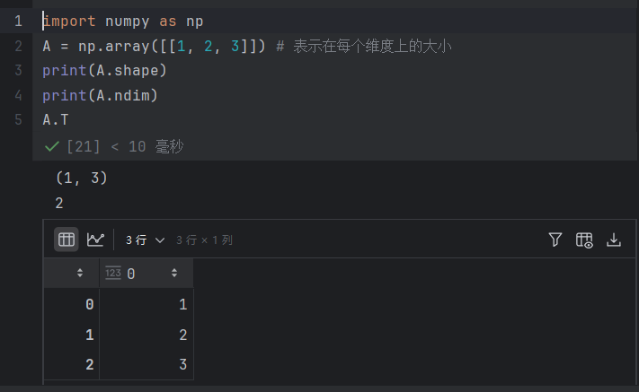

clone 是重新再分配新的内存，如果直接 `A = B` 那么不会分配新内存

```python
A = torch.arange(20, dtype=torch.float32).reshape(5, 4)
B = A.clone()  # 通过分配新内存，将A的一个副本分配给B
A, A + B
```

#### 哈达玛积和矩阵乘法：

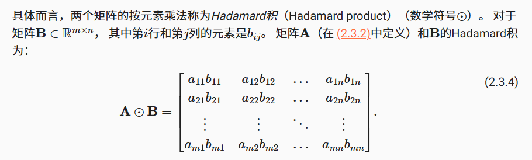

```python
A = torch.arange(16, dtype=torch.float32).reshape(4, 4)
B = A.clone()

# 哈达玛积（逐元素相乘）
hadamard = A * B
print("\n哈达玛积 A * B:\n", hadamard)

# 矩阵乘法
matmul = A @ B
print("\n矩阵乘法 A @ B:\n", matmul)
```

将张量乘以或加上一个标量不会改变张量的形状，其中张量的每个元素都将与标量相加或相乘。

```python
a = 2
X = torch.arange(24).reshape(2, 3, 4)
a + X, (a * X).shape # X所有元素+a，X所有元素*a
```

### 2.3.6. 降维

##### sum 求元素和

```python
x = torch.arange(4, dtype=torch.float32)
x, x.sum()
```

```python
A = torch.arange(40, dtype=torch.float32).reshape(2, 5, 4)
A.shape, A.sum()
```

##### 维度求和 

3D：

​	`axis = 0` 矩阵堆叠

​	`axis = 1` 行合并

​	`axis = 2` 列合并

2D：

​	`axis = 0` 行合并

​	`axis = 1` 列合并

**矩阵堆叠**：

```python
A_sum_axis0 = A.sum(axis=0)
A_sum_axis0, A_sum_axis0.shape
```

```
(tensor([[20., 22., 24., 26.],
         [28., 30., 32., 34.],
         [36., 38., 40., 42.],
         [44., 46., 48., 50.],
         [52., 54., 56., 58.]]),
 torch.Size([5, 4]))
```

**行合并**：

```python
A_sum_axis1 = A.sum(axis=1)
A_sum_axis1, A_sum_axis1.shape
```

```python
(tensor([[ 40.,  45.,  50.,  55.],
         [140., 145., 150., 155.]]),
 torch.Size([2, 4])) #行没了
```

**列合并**：

```python
A_sum_axis1 = A.sum(axis=2)
A_sum_axis1, A_sum_axis1.shape
```

```python
(tensor([[  6.,  22.,  38.,  54.,  70.],
         [ 86., 102., 118., 134., 150.]]),
 torch.Size([2, 5])) #  #列没了
```

**沿着行和列对矩阵求和，等价于对矩阵的所有元素进行求和**。

```python
A.sum(axis=[0, 1, 2])  # 结果和A.sum()相同
```

一个与求和相关的量是*平均值*（mean或average）。 我们通过将总和除以元素总数来计算平均值。 在代码中，我们可以调用函数来计算任意形状张量的平均值。

```python
A.mean(), A.sum() / A.numel(), A.sum() / len(A)
print(A.shape, A.numel(), len(A))
```

跑一下就知道了，我们看结果：

```python
torch.Size([2, 5, 4]) 40 2
```

同样，计算平均值的函数也可以沿指定轴降低张量的维度。

```python
A.mean(axis=0), A.sum(axis=0) / A.shape[0]
print(A.shape, A.shape[0], A.shape[1], A.shape[2])
```

输出结果：

```
torch.Size([2, 5, 4]) 2 5 4
```


### 补充：


`keepdims = True`的话，那么求和不会把轴去掉，而是变成1

```python
import torch

a = torch.ones(2, 5, 4)
a.shape
```

结果是：

```python
torch.Size([2, 5, 4])
```

求和之后：

```python
a.sum().shape
```

结果是：

```
torch.Size([]) #这说明是一个标量
```

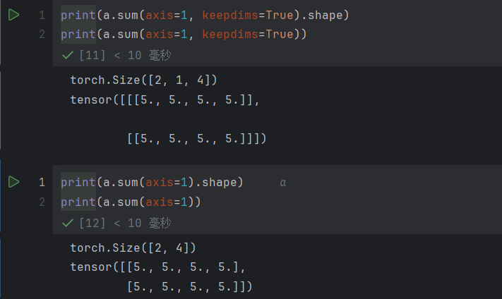

对比，会发现keepdims是保留了维度的


### 2.3.6.1. 非降维求和

但是，有时在调用函数来计算总和或均值时保持轴数不变会很有用。

```python
sum_A = A.sum(axis=1, keepdims=True)
print(sum_A, sum_A.shape)
print(A.shape)
print(A)

sum_A = A.sum(axis=1, keepdims=False)
print(sum_A, sum_A.shape)
print(A.shape)
print(A)
```

两段代码对照跑一下就发现确实不一样，keepdims保证了sum_A的轴数不变

```
A / sum_A # 广播机制
```

**累加求和**：

```
原始矩阵 B:
[[1 2 3]
 [4 5 6]
 [7 8 9]]

B.cumsum(axis=0):
[[ 1  2  3]   # 第0行保持不变
 [ 5  7  9]   # 第0行 + 第1行: [1+4, 2+5, 3+6]
 [12 15 18]]  # 前两行 + 第2行: [5+7, 7+8, 9+9]
```

### 2.3.7. 点积（Dot Product）

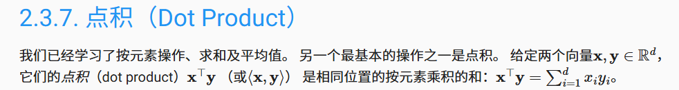

```python
y = torch.ones(4, dtype = torch.float32)
x, y, torch.dot(x, y)
```

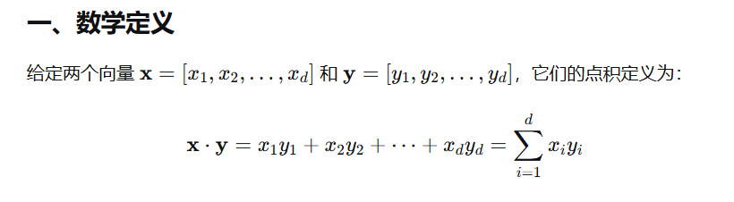

注意，我们可以通过执行按元素乘法，然后进行求和来表示两个向量的点积：

```python
torch.sum(x * y)
```

## 2.3.8. 矩阵-向量积

```python
import torch

# 假设 A 是矩阵，x 是向量
A = torch.tensor([[1., 2., 3.],
                  [4., 5., 6.]])  # 2×3矩阵
x = torch.tensor([1., 0., 2.])    # 3维向量

print("A.shape:", A.shape)      # torch.Size([2, 3])
print("x.shape:", x.shape)      # torch.Size([3])，一维张量/数组，有3个元素

# torch.mv() 是专门的矩阵-向量乘法函数
result = torch.mv(A, x)
print("torch.mv(A, x):", result)
print("result.shape:", result.shape)
```

`torch.Size([3])` 等价于`(3，)` ,**PyTorch便利性**：允许 `(2,3) × (3,)`，自动把一维向量当作合适的列/行向量

### 2.3.9. 矩阵-矩阵乘法

### 2.3.10. L2（欧几里得）范数

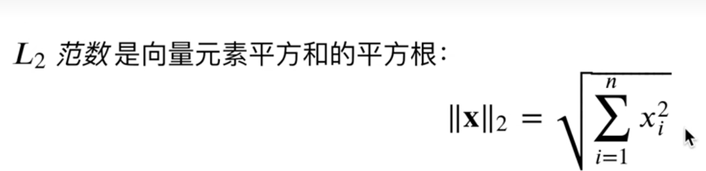

```python
u = torch.tensor([3.0, -4.0])
torch.norm(u)
```

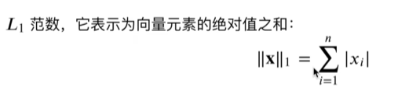

```python
torch.abs(u).sum()
```

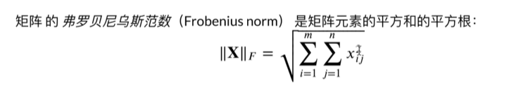

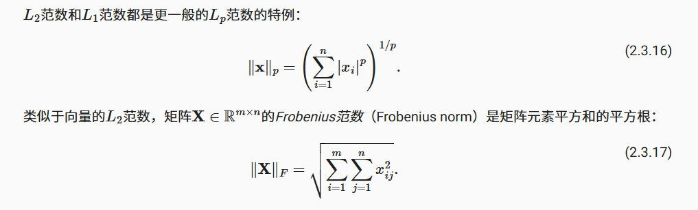

```python
torch.norm(torch.ones((4, 9))) # 把矩阵拉成一维向量
```

### 2.3.11. 关于线性代数的更多信息

### 2.3.12. 小结

### 2.3.13. 练习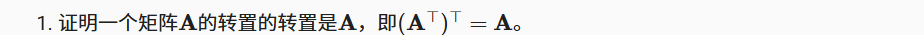

```python
import torch
A = torch.arange(12).reshape(3, 4)
B = A.T
print(B.T == A)
```

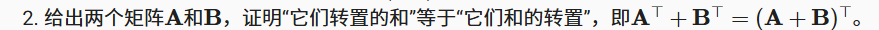

```python
A = torch.arange(12).reshape(3, 4)
B = torch.arange(1, 13).reshape(3, 4)
print(A.T + B.T == (A + B).T)
```

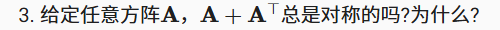

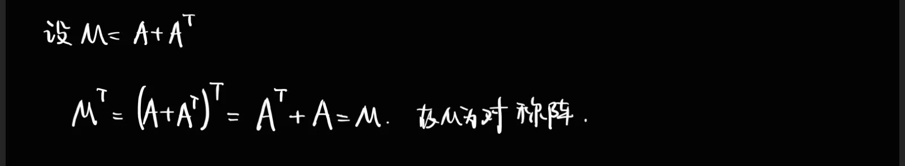

```python
A = torch.arange(16).reshape(4, 4)
B = A.clone()
print((A + A.T) == ((A + A.T).T))
```

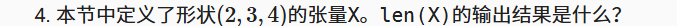

```python
x = torch.ones(2, 3, 4)
print(x.shape)
print(len(x))
```

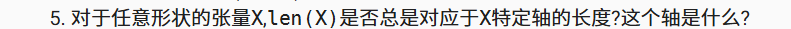

**最外层维度**（axis=0）的长度

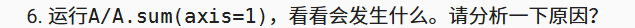

```python
A = torch.arange(16).reshape(4, 4)
print(A)
print(A.sum(axis=1))
result = A / A.sum(axis=1)
print("A / A.sum(axis=1) 的结果:")
print(result)
```

运行结果：

```
第一行： [0, 1, 2, 3] / 6 = [0.0000, 0.1667, 0.3333, 0.5000]
第二行： [4, 5, 6, 7] / 22 = [0.1818, 0.2273, 0.2727, 0.3182]
第三行： [8, 9, 10, 11] / 38 = [0.2105, 0.2368, 0.2632, 0.2895]
第四行： [12, 13, 14, 15] / 54 = [0.2222, 0.2407, 0.2593, 0.2778]
```

A.sum(axis=1)被广播成4*4的矩阵，然后和A做除法运算


```
A = torch.arange(24).reshape(2, 3, 4)
print(A)
A.sum(axis=0), A.sum(axis=1), A.sum(axis=2)
```

输出结果：

```
tensor([[[ 0,  1,  2,  3],
         [ 4,  5,  6,  7],
         [ 8,  9, 10, 11]],

        [[12, 13, 14, 15],
         [16, 17, 18, 19],
         [20, 21, 22, 23]]])

(tensor([[12, 14, 16, 18],
         [20, 22, 24, 26],
         [28, 30, 32, 34]]),
 tensor([[12, 15, 18, 21],
         [48, 51, 54, 57]]),
 tensor([[ 6, 22, 38],
         [54, 70, 86]]))
```

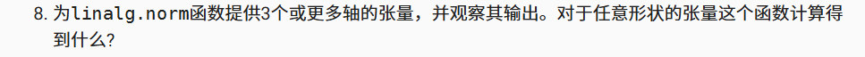

`torch.linalg.norm()`线性代数范数，范数：`（norm）`是向量长度的扩展概念

```
import torch

print("=== 实验不同维度张量的范数 ===\n")

# 1D 张量（向量）
print("1. 1D张量（向量）:")
x1 = torch.tensor([1.0, 2.0, 3.0, 4.0])
norm1 = torch.linalg.norm(x1)
print(f"张量: {x1}, 形状: {x1.shape}")
print(f"默认范数: {norm1}")
print(f"计算: sqrt(1² + 2² + 3² + 4²) = sqrt({1+4+9+16}) = sqrt(30) = {norm1:.4f}")
print()

# 2D 张量（矩阵）
print("2. 2D张量（矩阵）:")
x2 = torch.tensor([[1.0, 2.0], [3.0, 4.0]])
norm2 = torch.linalg.norm(x2)
print(f"张量:\n{x2}, 形状: {x2.shape}")
print(f"默认范数: {norm2:.4f}")
print(f"计算: sqrt(1² + 2² + 3² + 4²) = sqrt({1+4+9+16}) = sqrt(30) = {norm2:.4f}")
print()

# 3D 张量
print("3. 3D张量:")
x3 = torch.tensor([[[1.0, 2.0], [3.0, 4.0]], 
                   [[5.0, 6.0], [7.0, 8.0]]])
norm3 = torch.linalg.norm(x3)
print(f"张量形状: {x3.shape}")
print(f"元素: 1,2,3,4,5,6,7,8")
print(f"默认范数: {norm3:.4f}")
print(f"计算: sqrt(1²+2²+3²+4²+5²+6²+7²+8²) = sqrt({1+4+9+16+25+36+49+64}) = sqrt(204) = {norm3:.4f}")
print()

# 4D 张量
print("4. 4D张量:")
x4 = torch.randn(2, 3, 4, 5)  # 随机值
norm4 = torch.linalg.norm(x4)
print(f"张量形状: {x4.shape}")
print(f"总元素数: {x4.numel()}")
print(f"默认范数: {norm4:.4f}")
print()

# 5D 张量
print("5. 5D张量:")
x5 = torch.randn(2, 2, 3, 4, 5)
norm5 = torch.linalg.norm(x5)
print(f"张量形状: {x5.shape}")
print(f"总元素数: {x5.numel()}")
print(f"默认范数: {norm5:.4f}")
```

