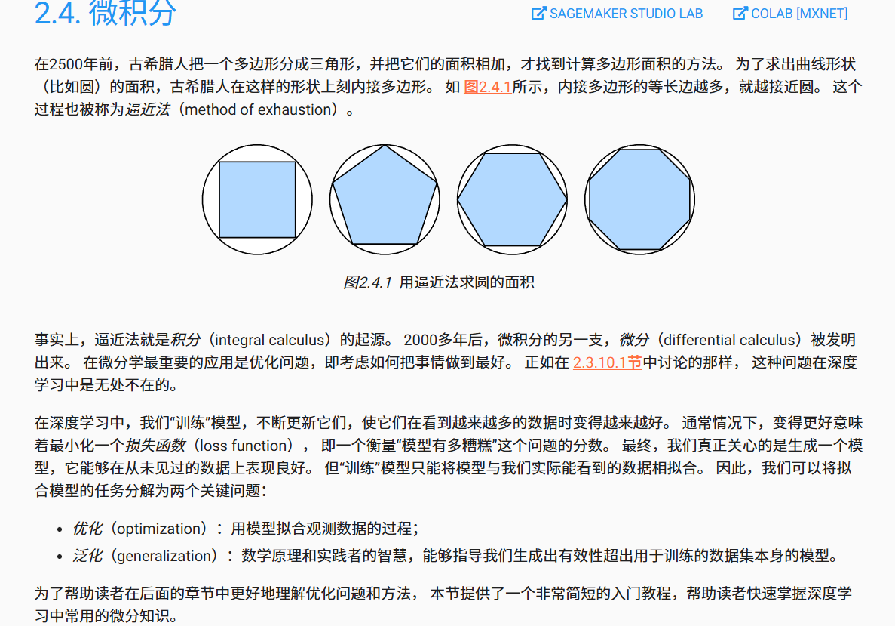
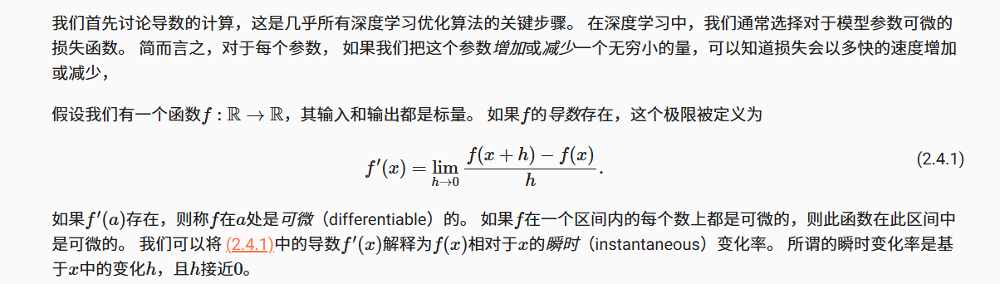
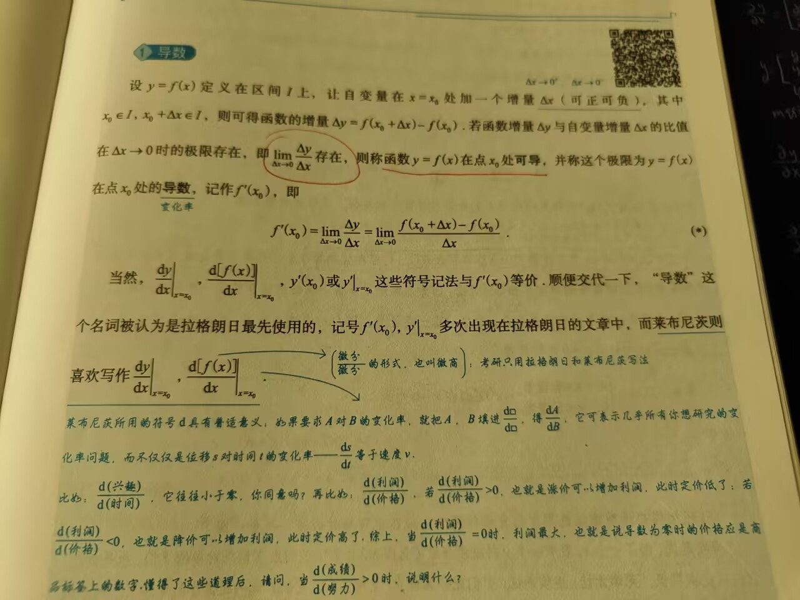
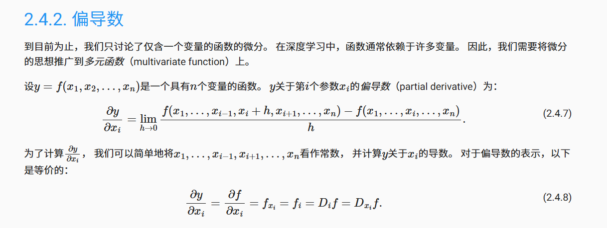
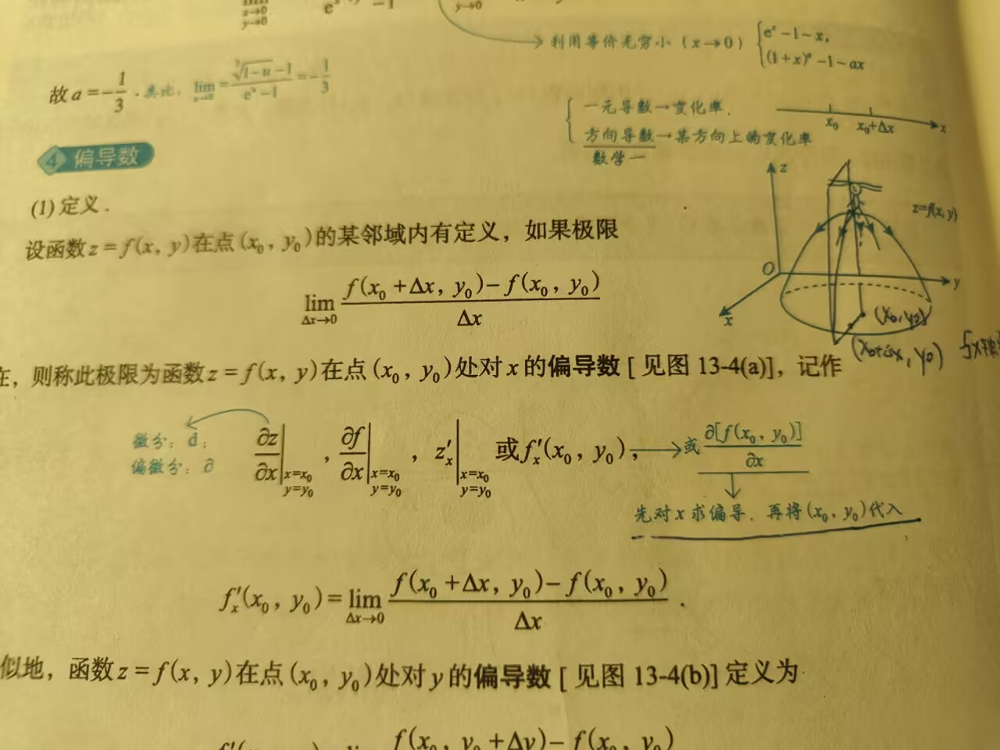
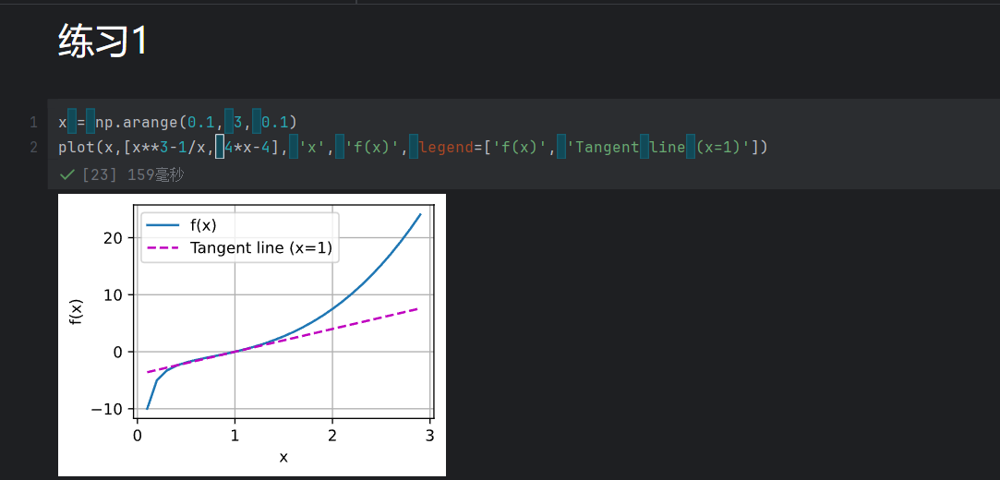
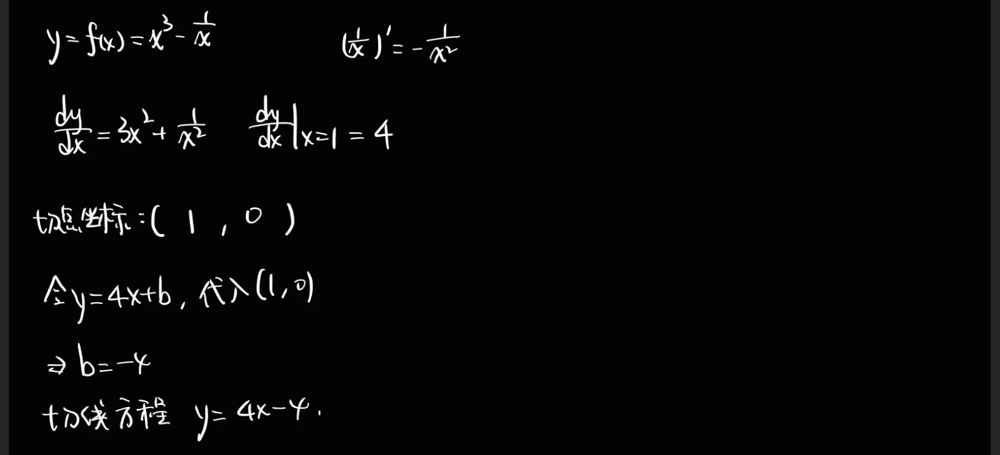
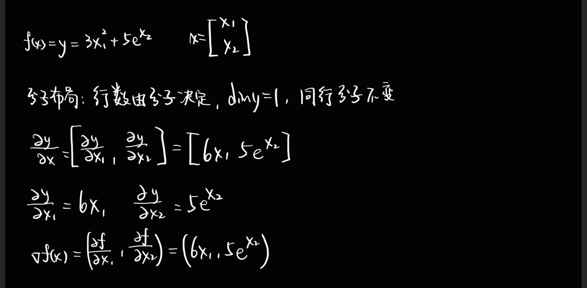
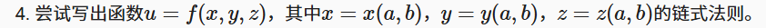

## 2.4. 微积分



### 2.4.1. 导数和微分






```python
"""
    绘制数据点
    X  # X轴数据，可以是：单个数组、列表、列表的列表
    Y  # Y轴数据（可选），格式同上。如果None，Y=X，X=[0,1,2,...]
    xlabel, ylabel  # 坐标轴标签
    legend          # 图例标签列表
    xlim, ylim      # 坐标轴范围，如 (0, 10)
    xscale, yscale  # 坐标轴比例：'linear', 'log', 'symlog'
    fmts  # 线条格式列表，如：('-', 'm--', 'g-.', 'r:')
          # '-'实线，'--'虚线，':'点线，'-.'点划线
          # m:洋红，g:绿色，r:红色，b:蓝色，c:青色，y:黄色，k:黑色，w:白色
    figsize  # 图形大小，如 (10, 6) 表示 10英寸宽，6英寸高
    axes     # 已有的坐标轴对象（如果不提供则创建新的）
"""
```

### 2.4.1. 导数和微分





### 2.4.5. 小结

### 2.4.6. 练习






```python
x = np.arange(0.1, 3, 0.1)
plot(x,[x**3-1/x, 4*x-4], 'x', 'f(x)', legend=['f(x)', 'Tangent line (x=1)'])
```




**数值求解**：

```python
import sympy as sp
x1, x2 = sp.symbols('x1 x2')
f = 3*x1**2+5*sp.exp(x2)
grad_f = [sp.diff(f, var) for var in (x1, x2)]
print("函数 f(x1, x2) =", f)
print("梯度 ∇f =", grad_f)
print("即：(", grad_f[0], ",", grad_f[1], ")")
```





