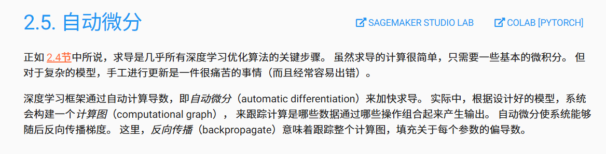
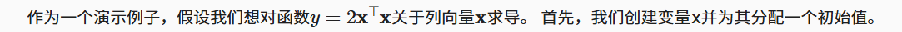
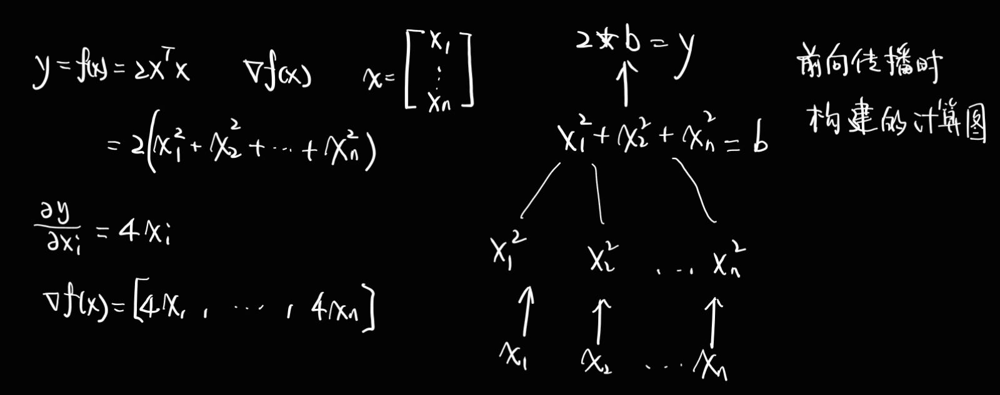
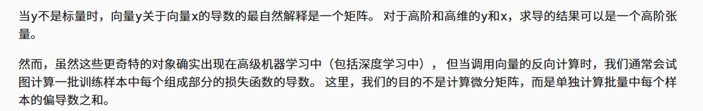
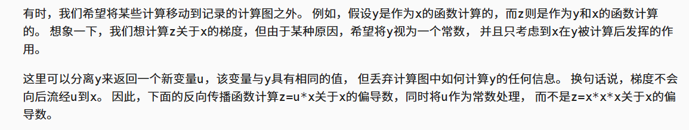
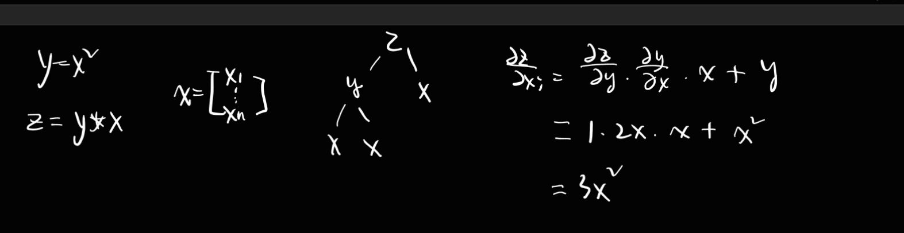
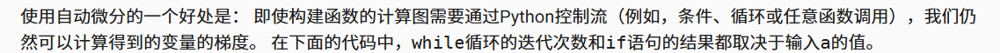

## 2.5. 自动微分



数值求解：diff_f,**grad**

torch那个是用计算图求的

### 2.5.1. 一个简单的例子



```python
import torch

x = torch.arange(4.0)
x
```


```
x.requires_grad_(True)  # 等价于x=torch.arange(4.0,requires_grad=True)
x.grad  # 默认值是None
```


```
y = 2 * torch.dot(x, x)
y
```


```
y.backward()
x.grad
```


```
x.grad == 4 * x
```




```
# 在默认情况下，PyTorch会累积梯度，我们需要清除之前的值
x.grad.zero_()
y = x.sum()
y.backward()
x.grad
```

### 2.5.2. 非标量变量的反向传播



```
# 对非标量调用backward需要传入一个gradient参数，该参数指定微分函数关于self的梯度。
# 本例只想求偏导数的和，所以传递一个1的梯度是合适的
x.grad.zero_()
y = x * x
# 等价于y.backward(torch.ones(len(x)))
y.sum().backward()
x.grad
```

### 2.5.3. 分离计算



```
x.grad.zero_()
print(x)
y = x * x
u = y.detach()
z = u * x
print(z.sum())
z.sum().backward()
x.grad == u
```

**规则**：`backward()` 只能被**标量（scalar）** 张量调用。

```
# 标量：明确的梯度方向
loss = tensor(3.14)  # 可以 backward()

# 向量：模糊的梯度方向
losses = tensor([1.0, 2.0, 3.0])  # 不能直接 backward()！
```

#### **数学原因：梯度的定义**

- 标量函数 `f(x)` 的梯度是一个向量：`∇f = [∂f/∂x₁, ∂f/∂x₂, ...]`
- 向量函数 `f(x) = [f₁(x), f₂(x), ...]` 的"梯度"是雅可比矩阵

#### **实用原因：深度学习需求**

在深度学习中，我们通常需要：

- 一个**单一的损失值**来衡量模型好坏
- 计算**这个损失对每个参数的偏导数**
- 然后用这些梯度**同时更新所有参数**


```
x.grad.zero_()
print(x)
y = x * x
u = y.detach()
z = u * x
print(z)
print(z.sum())
z.sum().backward()
x.grad == u
```



```
x.grad.zero_()
print(x)
y = x * x
z = y * x
print(z)
print(z.sum())
z.sum().backward()
x.grad == 3*y
```

detach截断之后u就相当于一个新的变量,只是值为x^2的值

### 2.5.4. Python控制流的梯度计算




我们之前分析过，这个函数实际上可以写成：f(a) = k × a

对于 `f(a) = k × a`：

- **导数**：`f'(a) = ∂f/∂a = k`

- **函数值**：`f(a) = k × a`

- **因此**：`f(a)/a = (k × a)/a = k`

- ```python
  ∂f/∂a = k = f(a)/a
  a.grad = d/a
  ```

```python
def f(a):
    b = a * 2
    while b.norm() < 1000:
        b = b * 2
    if b.sum() > 0:
        c = b
    else:
        c = 100 * b
    return c
```

```python
a = torch.randn(size=(), requires_grad=True)
print(a)
d = f(a)
d.backward()
```

```python
a.grad == d / a
print(a.grad)
```

### 2.5.5. 小结

### 2.5.6. 练习


计算二阶导数是建立在一阶导数基础上的，当然开销更大


```python
import torch

# 创建需要梯度的张量
x = torch.tensor([1.0, 2.0, 3.0], requires_grad=True)
print(f"初始 x = {x}")

# 前向传播
y = x ** 2  # y = x²
d = y.sum() # d = Σx² = 1+4+9=14
print(f"y = {y}")
print(f"d = y.sum() = {d}")

# 第一次反向传播
print("\n=== 第一次 backward() ===")
d.backward()
print(f"第一次后 x.grad = {x.grad}")  # [2, 4, 6] = 2x

# 立即第二次反向传播
print("\n=== 立即第二次 backward() ===")
try:
    d.backward()
except RuntimeError as e:
    print(f"错误: {e}")
```

1. **计算图被释放**：PyTorch默认在第一次`backward()`后会**释放计算图**以节省内存
2. **无法二次传播**：梯度需要计算图来传播，图被释放后无法再次反向传播


```python
def f(a):
    b = a * 2
    while b.norm() < 1000:
        b = b * 2
    if b.sum() > 0:
        c = b
    else:
        c = 100 * b
    return c
a = torch.tensor([1.0, 2.0, 3.0], requires_grad=True)
d = f(a)
print(d)
d.sum().backward()
a.grad == d / a
```


```python
import torch

def piecewise_function(x):
    """
    设计一个分段函数：
    - 如果 x > 0: f(x) = x^2
    - 如果 x ≤ 0: f(x) = -x^3
    """
    if x > 0:
        y = x ** 2
    else:
        y = -(x ** 3)
    return y

# 测试
print("=== 示例1：分段函数 ===")
test_values = [-2.0, -1.0, 0.0, 1.0, 2.0]

for val in test_values:
    x = torch.tensor(val, requires_grad=True)
    y = piecewise_function(x)
    y.backward()
    
    # 理论梯度
    if val > 0:
        theoretical_grad = 2 * val  # x²的导数是2x
    else:
        theoretical_grad = -3 * val**2  # -x³的导数是-3x²
    
    print(f"x={val:4.1f}, f(x)={y.item():6.2f}, "
          f"PyTorch梯度={x.grad.item():6.2f}, "
          f"理论梯度={theoretical_grad:6.2f}, "
          f"一致? {abs(x.grad.item() - theoretical_grad) < 1e-6}")
```


```python
def f(x):
    return torch.sin(x)
# 生成x值 - 使用PyTorch张量，启用梯度
x = torch.arange(-10, 10, 0.1, requires_grad=True)  # 修正：10而不是11
y = f(x)

# 计算梯度 - 需要为每个点单独计算
gradients = []
for i in range(len(x)):
    # 清零之前的梯度
    if x.grad is not None:
        x.grad.zero_()

    # 计算该点的函数值
    y_i = f(x[i])

    # 计算该点的梯度
    y_i.backward(retain_graph=True)
    # print(x.grad[i])
    # 保存梯度
    # 将包含单个元素的张量转换为 Python 标量值
    gradients.append(x.grad[i].item())
x_np = x.detach().numpy()
y_np = y.detach().numpy()
grad_np = np.array(gradients)

# 使用plot函数绘图
plot([x_np, x_np],[y_np, grad_np],
     'x', 'f(x)', legend=['f(x) = sin(x)', "f'(x) = df/dx"],
     figsize=(8, 4))
```